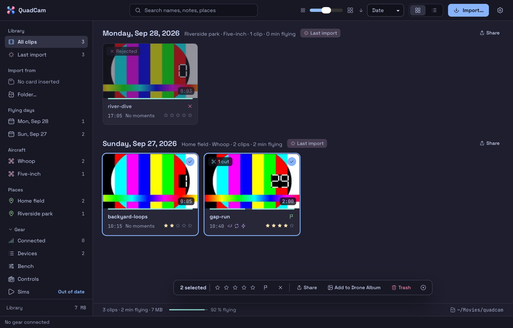
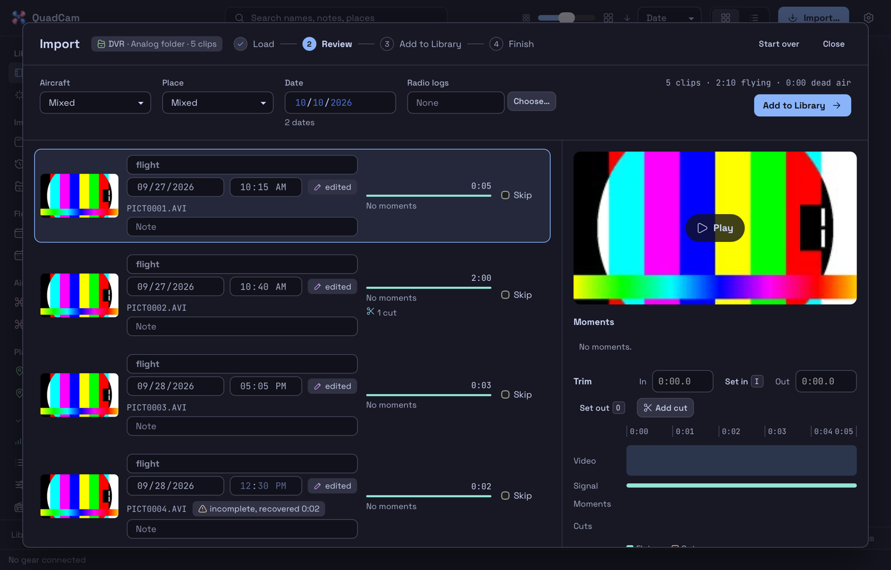
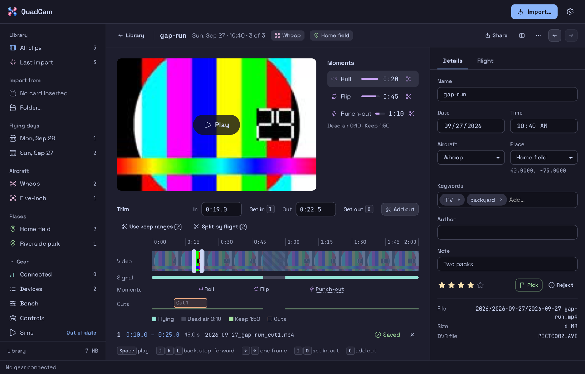

# QuadCam

QuadCam is a macOS app that imports the recordings from your FPV goggles into a video library. It copies the clips off the card, dates and names them, converts them to MP4, verifies every file, and files it by flying day.



## Features

- **Dated clips.** Analog DVRs have no clock. QuadCam dates each clip from your EdgeTX radio logs, matched by flight lengths or, for an analog clip with dead air, by how the flights fit its picture between battery swaps. Otherwise it uses the import date. DJI clips carry their own clock, and a matching radio log refines it.
- **Named files.** Each file is `YYYY-MM-DD_<name>.mp4`, in a folder per year and per flying day.
- **Small MP4s.** Hardware H.264 makes files that play everywhere and are much smaller than the DVR's MJPEG. A lossless MOV option keeps the original frames. DJI clips are already H.264 or H.265: QuadCam copies them as they are.
- **Verified imports.** QuadCam compares every output with its source: frame count, duration, streams and metadata. It recovers half-written clips, for example after a power-off during recording, and marks empty ones.
- **Moments and dead air.** QuadCam finds rolls, flips, punch-outs and dives in the radio log, and the no-signal stretches in the video. You export any range as a cut. **Split by flight** makes one cut per radio-log flight.
- **Long recordings stay whole.** An analog DVR splits a long recording into files of a fixed length (10 minutes on a Fat Shark Echo) or size. QuadCam imports those files as one clip. See [Joined recordings](docs/library.md#joined-recordings).
- **A library you can trust.** Rate, flag, search, rename and edit your clips. Every detail is written into the file itself, and the index rebuilds from the files.
- **Metadata that Photos reads.** Date, time, place, aircraft and keywords go into QuickTime tags. Add clips to Photos, into an album.
- **Safe card format.** When every clip verified, QuadCam can erase an analog card as FAT32 and unmount it, behind strict guards. Card prep formats a spare card whose clips are all in the library: FAT32 for an analog DVR, exFAT for a DJI goggles card. It never formats a DJI device over USB.
- **Room for the next flight.** With **Delete clips after import** on, QuadCam deletes each clip that verified from the card, DJI air units included, and leaves every other file. It is off by default. See [Settings](docs/settings.md#delete-clips-after-import).
- **Gear.** Gear is the FPV bench next to the library. See [Gear](docs/gear.md).
  - **Devices.** QuadCam finds EdgeTX radios, DJI goggles and air units, DVR cards, flight controllers and ExpressLRS devices when you plug them in. Save a device to name it and link it to an aircraft.
  - **Card jobs.** QuadCam mounts a card for each job and unmounts it when the job ends. It backs up radio cards and flight controllers, checks a known card's file system, and prepares spare cards.
  - **Flight controllers.** Draw and edit the Betaflight OSD and rates, copy settings between quads, and pull the blackbox flash. Stage changes, check them, apply them and read them back. The Bench lists what waits.
  - **Radios.** Edit models and checklists, build a voice pack in the voice studio, and see what each switch does on the radio and the quad. The Controls page shows sticks and switches live in USB Joystick mode.
  - **Firmware.** Check for new releases and **Read firmware** from a radio. Flashing an EdgeTX radio is available. Betaflight flashing and ExpressLRS tools are previews that you turn on in Settings.
  - **Flights and packs.** QuadCam reads flights from radio logs, keeps packs with their history, logs crashes and repairs, writes a session report after an import, and checks your gear before a session.
- **Scripts and agents.** A command-line tool and an MCP server do everything the app does.

## Supported gear

QuadCam reads two sources, on a card or in a folder:

- **Analog goggle and DVR recordings:** MJPEG video in AVI files (`PICT0001.AVI` and similar), at the root or in folders such as `DCIM/`. Known to work: the Fat Shark Echo. Other DVRs that write MJPEG AVI should work. QuadCam does not read DVRs that write `.TS`, `.MOV` or `.MP4` yet.
- **DJI recordings:** MP4 files named by the unit's clock (`DJI_20261004183012_0001_D.MP4`) under `DCIM/DJI_*/`, for example from an O4 air unit over USB or a goggles card. Older `DJIG0001.MP4` names count too. With **Keep originals** on, QuadCam keeps the `.SRT` file next to the original. QuadCam assumes the default setting, where the unit records on arm and stops on disarm, so each file usually holds one flight. Manual recording works too, but QuadCam does not join DJI files that the unit split from one long recording.

The app watches for removable volumes that hold either kind, cards in the Mac's built-in SD slot included, and shows the source next to each card. For dates and moments, it reads EdgeTX "SD Logs" CSV files.

**HDZero and Walksnail** recordings are out of scope for 1.0. QuadCam does not read them. Support may come later.

**Sample recordings wanted.** If you fly HDZero or Walksnail, a few short clips straight
off your goggle card help build and test that support. Send the files exactly as the card holds
them, folder layout and sidecar files (`.srt`, `.osd`) included, and say which goggles and
firmware recorded them. Open an issue with a download link. Shared files are used only for
development and tests, and only clips you mark as freely shareable go into the repo.

QuadCam was built with a Fat Shark Echo and a RadioMaster Pocket on EdgeTX in mind. The automated tests use synthetic clips and logs in the same formats, not real cards.

## Install

QuadCam needs an Apple Silicon Mac with macOS 13 or later. Install it with Homebrew:

```bash
brew install --cask noahkiss/tap/quadcam
```

The cask installs:

- `QuadCam.app` in `/Applications`
- the command-line tool `quadcam-cli` on your `PATH`

QuadCam needs ffmpeg to convert and verify clips. The first time you open the app, a banner offers to download it as a module. It shows the license, size and source first, and downloads nothing until you select **Download**. **Settings > Modules** manages it later. A Homebrew ffmpeg that is already installed also works. See [Modules and notices](docs/modules.md).

To update, run `brew upgrade --cask quadcam`. To remove the app, run `brew uninstall --cask quadcam`. Uninstall keeps your settings and your videos.

### Signing

NKMK Digital Co. signs QuadCam with its Apple Developer ID, and Apple notarizes every release after 0.5.3. macOS opens the app without a warning, whether it came from Homebrew or from the zip on the [releases page](https://github.com/noahkiss/quadcam/releases). Releases up to 0.5.3 have an ad-hoc signature only: update to a newer one.

## Quick start

1. **Load the clips.** Insert the card. It shows in the sidebar under **Import from**, with the number of new clips. Select it. You can also select **Folder…**, or drag a folder or clip files onto the window.
2. **Wait for the copy.** The Import sheet opens and copies every clip to a local folder first. The sheet header shows how many files are left and the progress of the current one. You can pull the card when the copy is done.
3. **Review.** Set the aircraft, the place and the date for all clips at once, or per clip. Type a short name for each clip. Select **Skip** for clips you do not want, such as bench tests. A recording that the DVR split into several files shows as one clip with its files; **Keep files separate** imports them one by one.
4. **Add radio logs (optional).** Under **Radio logs**, select **Choose…** and pick your radio's `LOGS` folder. QuadCam then dates the clips and finds their moments.
5. **Trim (optional).** Select a clip to play it, see its moments and set cuts. **Split by flight** adds one cut per radio-log flight.
6. **Add to Library** (Command-Return). QuadCam converts and verifies each clip. When **Delete clips after import** is on in Settings, a checkbox above the button shows it; clear it to keep the clips on the card for this import.
7. **Finish.** QuadCam unmounts the card when the import is done, so it is safe to remove. Add the files to Photos, or format the card (analog cards only; QuadCam mounts it again for that and unmounts it after). A DJI card has **Prepare card** instead. **Done · show in Library** shows the new clips under **Last import**.



You can close the sheet at any time. The import stays in the sidebar as **Unfinished import** until you finish it.

Open a clip in the library to edit its details, rate it, and trim it:



QuadCam follows the system's light or dark appearance. [A light-mode screenshot](docs/images/library-light.png) shows the library in light mode.

## Documentation

| Topic | Covers |
|---|---|
| [The library](docs/library.md) | Folder layout, file names, dates, the index, clip identity, keys and menus |
| [Moments and cuts](docs/moments-and-cuts.md) | Dead air, radio-log moments, the trim editor, cut files |
| [Metadata](docs/metadata.md) | QuickTime tags, places and place search providers, aircraft profiles, radio logs |
| [Settings](docs/settings.md) | Each Settings section and the settings file |
| [Modules and notices](docs/modules.md) | Tools QuadCam downloads on request (ffmpeg, esptool), their pins and checks, and the third-party notices |
| [Photos](docs/photos.md) | Albums, permissions, `QUADCAM_PHOTOS` |
| [Format safety](docs/format-safety.md) | When QuadCam erases a card, and the guards it checks first |
| [Command line](docs/cli.md) | `quadcam-cli`: import, library, places, profiles, settings, JSON output |
| [MCP server](docs/mcp.md) | Connect a coding agent, the 19 tools, the control socket |
| [Development](docs/development.md) | Build from source, tests, project layout, releases |
| [Gear](docs/gear.md) | Devices QuadCam finds, saved devices, EdgeTX cards, backups, the card check, cues, flights, packs, crashes, `quadcam-cli gear` |
| [Gear design](docs/gear-design.md) | The plan for gear: device backups, staged changes, OSD, rates, sims, voice packs, firmware, flight analysis |
| [Sim](docs/sim.md) | The built-in sim so far: calibrating the radio for it, flying the plain room, the flight model and its check against your blackbox logs |
| [Sim design](docs/sim-design.md) | The plan for the built-in sim: physics, flight controller, quad profiles from blackbox, radio calibration, engine choice (draft) |

## Privacy

QuadCam works on your Mac. It sends data out only when you ask it to:

- A place search sends the search text to the provider you picked. See [Metadata](docs/metadata.md#place-search-providers).
- A module install downloads the module from its upstream, and **Check for updates** reads `modules.json` from QuadCam's latest GitHub release. See [Modules](docs/modules.md).
- **Gear > Firmware > Check for updates** reads the newest EdgeTX, Betaflight and ExpressLRS releases from GitHub and the ExpressLRS release index. Planning an EdgeTX flash downloads that release's firmware zip. With `firmware_check` set to `daily` in the settings file, the page also checks once a day. **Read firmware** saves a copy of a radio's firmware over USB (DFU) without changing the radio. See [Gear](docs/gear.md#firmware-and-splash).

## License

MIT. See [LICENSE](LICENSE). **QuadCam > Acknowledgements** lists the third-party software and fonts in the app and their licenses.
